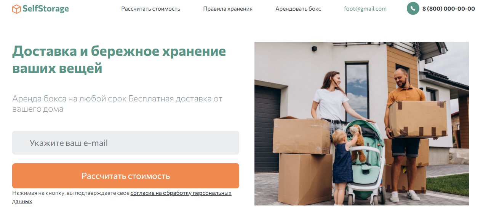
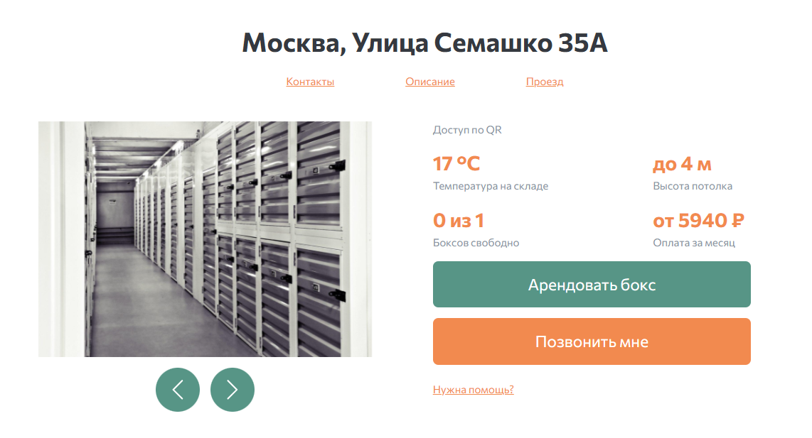
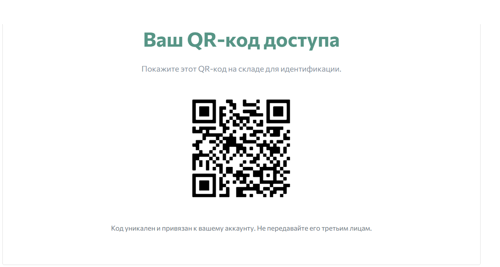

# SelfStorage

[](https://github.com/Pavelwell7/self-storage)
[](LICENSE)
[](#)

Сервис аренды боксов для самостоятельного хранения вещей (self-storage). Командный проект - веб-приложение на Django, где пользователь может посмотреть каталог складов, выбрать свободный бокс подходящего размера и оформить аренду через личный кабинет.

## Возможности

- Регистрация и авторизация пользователей
- Каталог складов с фильтром боксов по площади (до 3 м², до 10 м², от 10 м²)
- Личный кабинет с информацией о текущей аренде
- QR-код для доступа к боксу при активной аренде

## Пример работы

### Главная страница


### Каталог боксов


### QR-код для доступа к боксу
При активной аренде в личном кабинете пользователю доступен QR-код — по нему можно открыть свой бокс на складе, не вводя код или ключ вручную.




## Как запустить проект локально

1. Клонируйте репозиторий и перейдите в папку проекта:
   ```bash
   git clone <ссылка на репозиторий>
   cd self-storage
   ```

2. Создайте и активируйте виртуальное окружение:
   ```bash
   python -m venv .venv
   # Windows
   .venv\Scripts\activate
   # Linux/Mac
   source .venv/bin/activate
   ```

3. Установите зависимости:
   ```bash
   pip install -r requirements.txt
   ```

4. Создайте файл `.env` в корне проекта и заполните переменные:
   ```
   SECRET_KEY=ваш-секретный-ключ
   DEBUG=True
   ALLOWED_HOSTS=127.0.0.1,localhost
   ```

5. Примените миграции:
   ```bash
   python manage.py migrate
   ```

6. Создайте суперпользователя для доступа в админку:
   ```bash
   python manage.py createsuperuser
   ```

7. Запустите сервер разработки:
   ```bash
   python manage.py runserver
   ```

Сайт будет доступен по адресу http://127.0.0.1:8000/, админка - http://127.0.0.1:8000/admin/.

## Деплой

Проект развёрнут на сервере, доступен по адресу:
- Сайт: http://82.148.29.83
- Админка: http://82.148.29.83/admin

Для доступа к админке используйте учётные данные, выданные администратором проекта, либо создайте своего суперпользователя через `python manage.py createsuperuser` при локальном запуске.


## Стек технологий

- **Python 3, Django** - веб-фреймворк
- **SQLite** - база данных для разработки
- **django-allauth** - регистрация и авторизация пользователей по e-mail (без username)
- **django-phonenumber-field** - валидация и хранение номера телефона в профиле пользователя
- **environs** - работа с переменными окружения (`.env`)
- **Pillow** - обработка изображений (фото складов)
- **Bootstrap 5** - вёрстка
- **django_qr_code** - генерация изображений qr-кода для доступа к боксу

## Зависимости проекта

Все зависимости зафиксированы в `requirements.txt`:

| Пакет | Версия | Назначение                                                              |
|--|--|-------------------------------------------------------------------------|
| Django | 5.1.4 | основной веб-фреймворк                                                  |
| environs | 11.0.0 | чтение переменных окружения из `.env` (SECRET_KEY, DEBUG и т.д.)        |
| Pillow | 11.0.0 | работа с изображениями, требуется для полей `ImageField` (фото складов) |
| django-allauth | 65.19.1 | система регистрации/авторизации с входом по e-mail                      |
| django-phonenumber-field | 8.5.0 | хранение и валидация номера телефона пользователя                       |
| django_qr_code | 4.2.0 | генерация изображений qr_кода                                           |